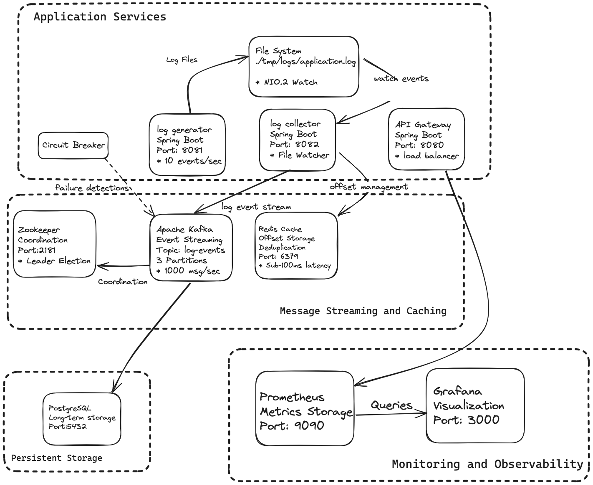

# Distributed Log Processing System

A production-ready distributed log processing system built with Spring Boot, Apache Kafka, Redis, and PostgreSQL. This system demonstrates key distributed system patterns including event-driven architecture, circuit-breakers, distributed caching, and comprehensive observability.

### Infrastructure Components

- **Apache Kafka**: Message streaming platform for event-driven architecture
- **Redis**: Distributed caching and rate limiting
- **PostgreSQL**: Persistent storage for processed log events
- **Prometheus**: Metrics collection and monitoring
- **Grafana**: Metrics visualization and dashboards

### Distributed Log Collector Service Architecture

This is a production grade log collector service that forms the backbone of any distributed logging system.

- **File System Watcher Service**: Real-time detection of log file changes using Java NIO.2 WatchService with configurable polling strategies
- **Event-Driven Stream Processing**: Kafka-backed message streaming that handles log entries as they're discovered, with guaranteed delivery semantics
- **Resilient Collection Pipeline**: Circuit breaker patterns and retry mechanisms that gracefully handle file system failures and temporary outages.
- **Distributed State Management**: Redis-backed offset tracking and deduplication to ensure exactly-once processing across service restarts.

