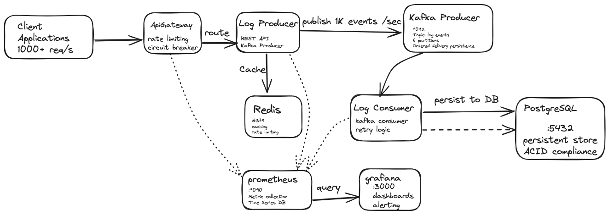

# Distributed Log Processing System

A production-ready distributed log processing system built with Spring Boot, Apache Kafka, Redis, and PostgreSQL. This system demonstrates key distributed system patterns including event-driven architecture, circuit-breakers, distributed caching, and comprehensive observability.

## System Architecture 

The system consists of three main services:

- **API Gateway** (Port 8080): Routes requests, handles rate limiting, and provides unified API access.
- **Log Producer** (Port 8081): REST API that accepts log events and publishes them to Kafka.
- **Log Consumer** (Port 8082): Kafka consumer that processes events and stores them in PostgreSQL

### Infrastructure Components

- **Apache Kafka**: Message streaming platform for event-driven architecture
- **Redis**: Distributed caching and rate limiting
- **PostgreSQL**: Persistent storage for processed log events
- **Prometheus**: Metrics collection and monitoring
- **Grafana**: Metrics visualization and dashboards

